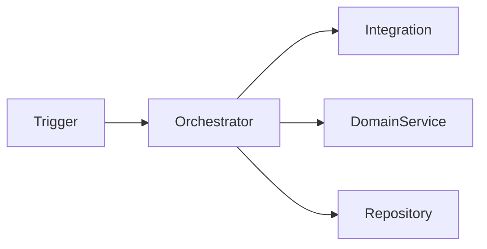

# Architecture: <Change>

**Based on:** [`brief.md`](brief.md)

## Design drivers

<!-- Only requirements, constraints, evidence, or repository realities that materially shape architecture. -->

- ...

## Architecture

<!-- One concise description and, when useful, one Mermaid component diagram. -->

## Components

### <component, including its type name in code if applicable>

**Role:**  its role in the architecture

**Owns:** data and logic it is responsible for

**Used By:** other components

**Uses:** other components or external systems

<!-- Omit section if not applicable. Use list format if multiple items -->

## Runtime flows

### <Normal flow>

1. ...

### <Architecturally distinct retry, duplicate, replay, or failure flow>

1. ...

<!-- Normally 2–4 flows total. -->

## Decisions

### <Decision>

- **Choice:** ...
- **Reason:** ...
- **Trade-off:** ...
- **Rejected:** <credible alternative and one-line reason>

